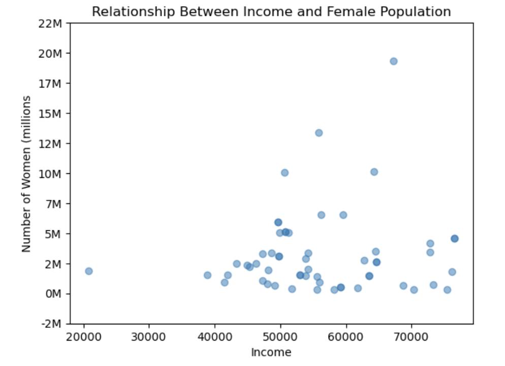
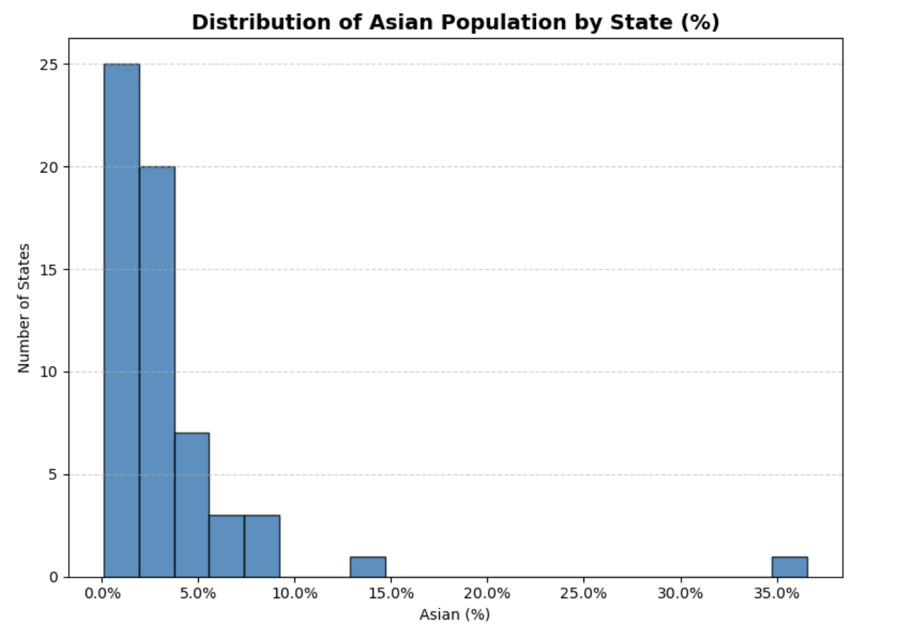
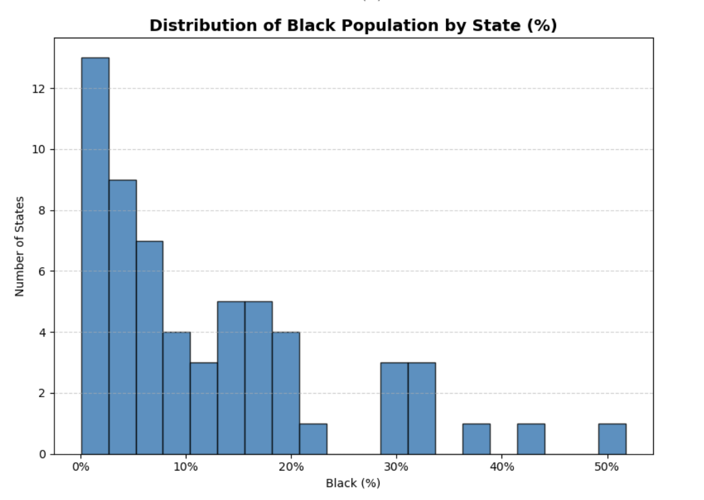
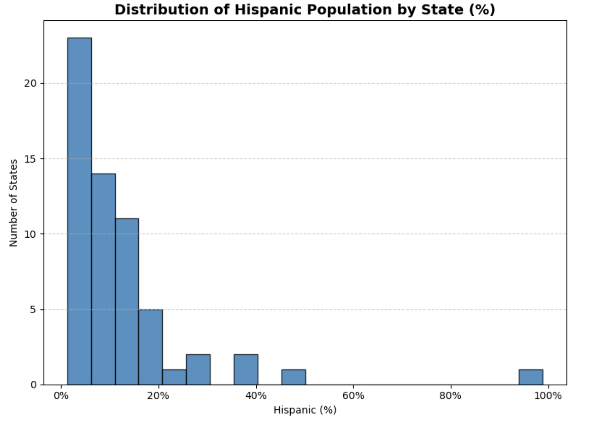
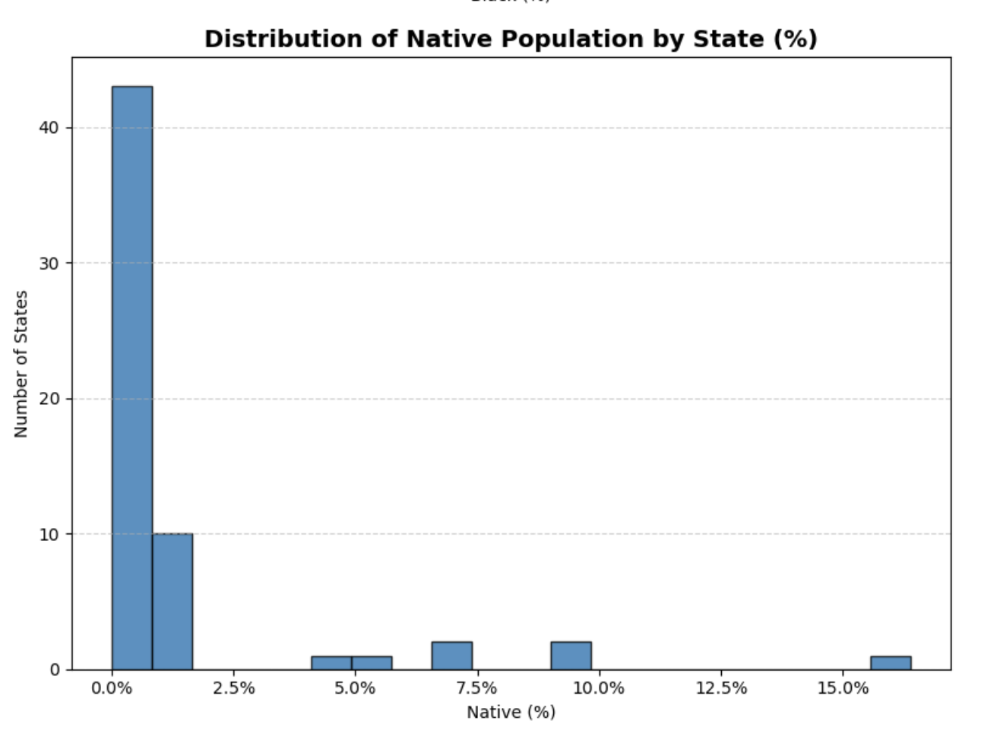
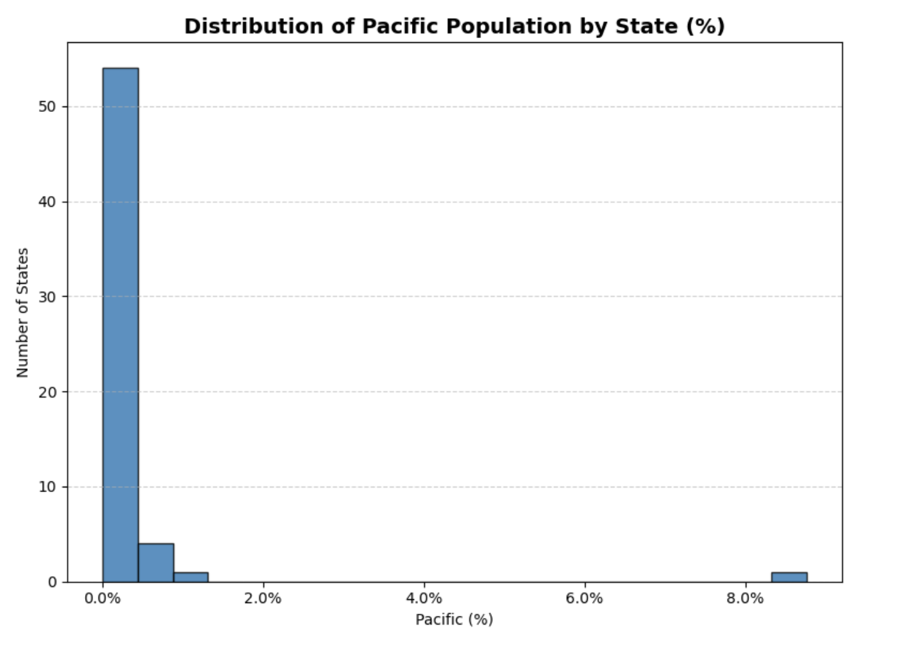
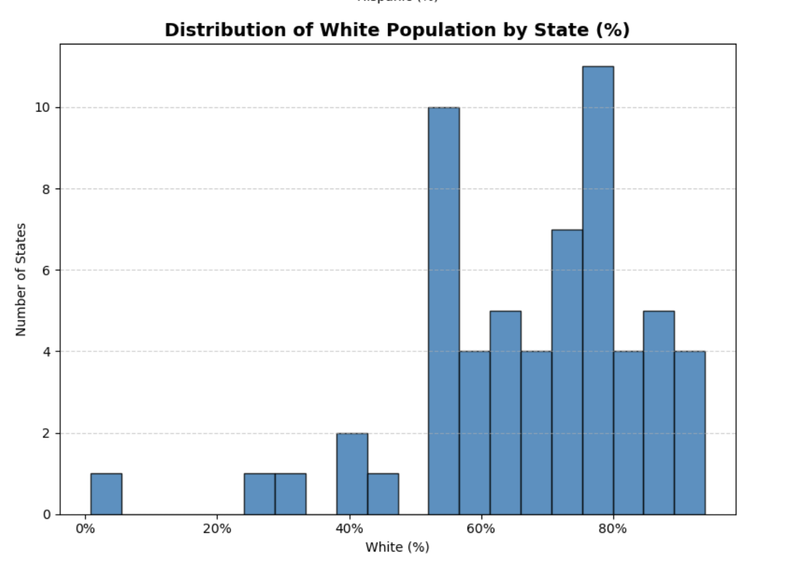

# Cleaning and Visualizing U.S. Census Data with Pandas

### Goals
handle missing data, duplicates, format inconsistencies

### Pipeline Steps
import → clean → fill NaNs → drop duplicates → visualize

### Visualizations 
scatter (income vs women), histograms (race breakdown)

**Women and Income**

This scatterplot explores the relationship between female population size and median income across states.

  

**Demographic Distribution Histograms**

These histograms illustrate percentage distributions across states for demographic categories in the dataset.  

  

  

  

  

  

  

